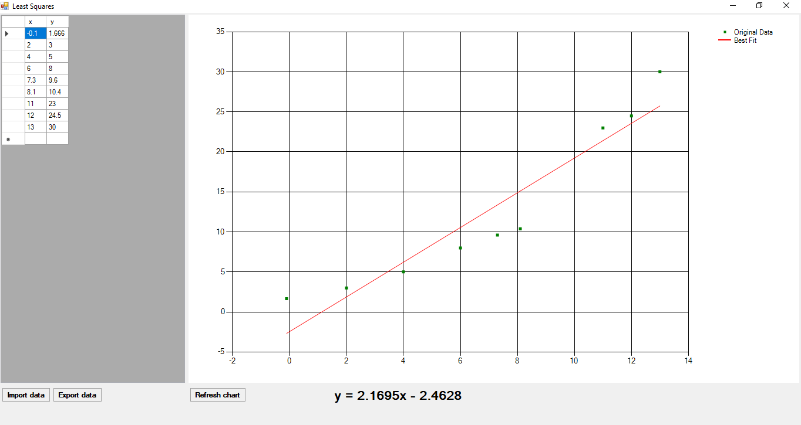

# least_squares
This program takes a set of points from a CSV file, plots it as a scatter plot, and displays a best-fit linear approximation.

# Technology
Winforms with C#

# Sample Output

# Button Actions

## Import data
When pressed, the user is requested for a CSV file. When supplied, the file is opened, the data is displayed in the LH panel, and a chart is displayed in the RH panel. 
This chart displays the data points found in the file, then calculates a best-fit line through the data points. 
The equation for this line is displayed in the bottom right.

## Export Data
When pressed, the user is requested for a CSV file. When supplied, the data shown in the LH panel is written to that file.

## Refresh chart
The user is able to update the data in the LH panel at any time. However, the chart is not automatically updated. 
Pressing the "Refresh chart" button causes the program to reread the data and redisplay the chart.